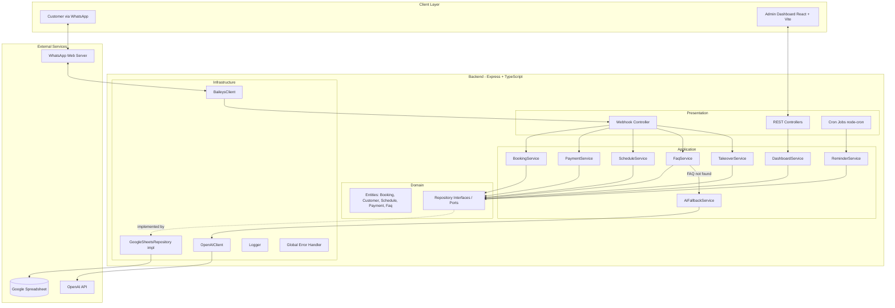
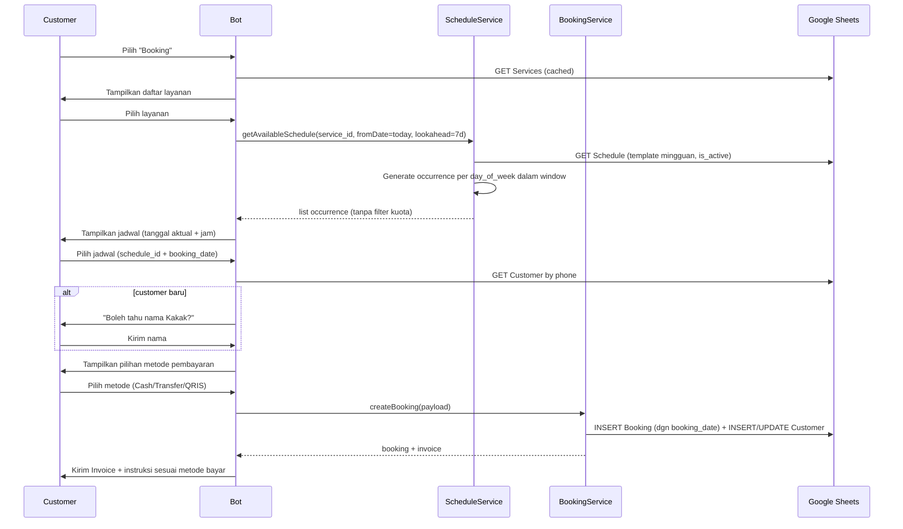
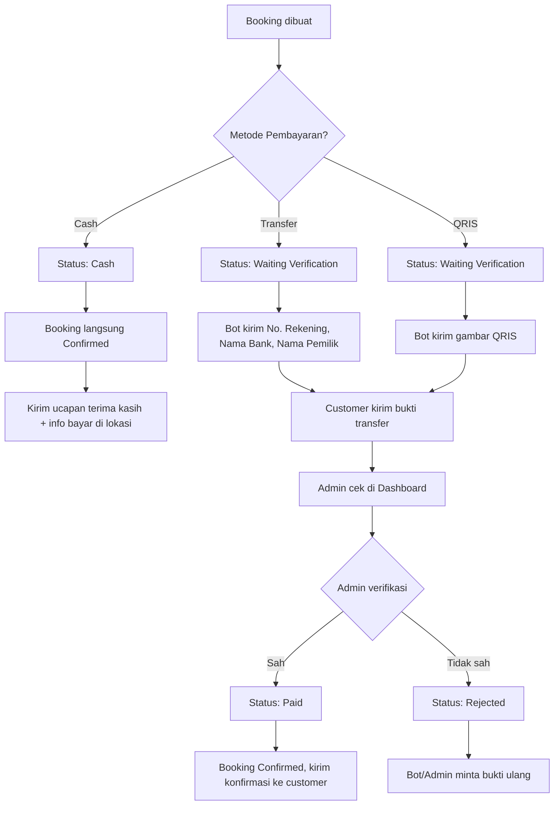
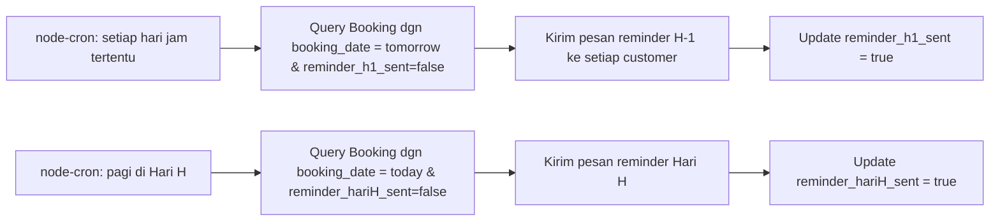
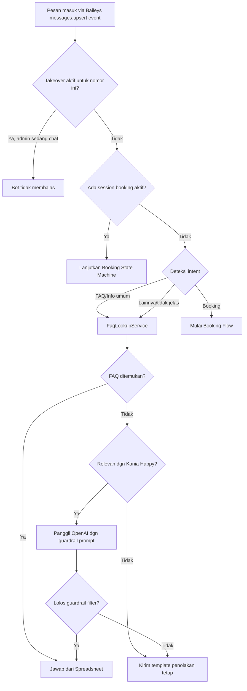
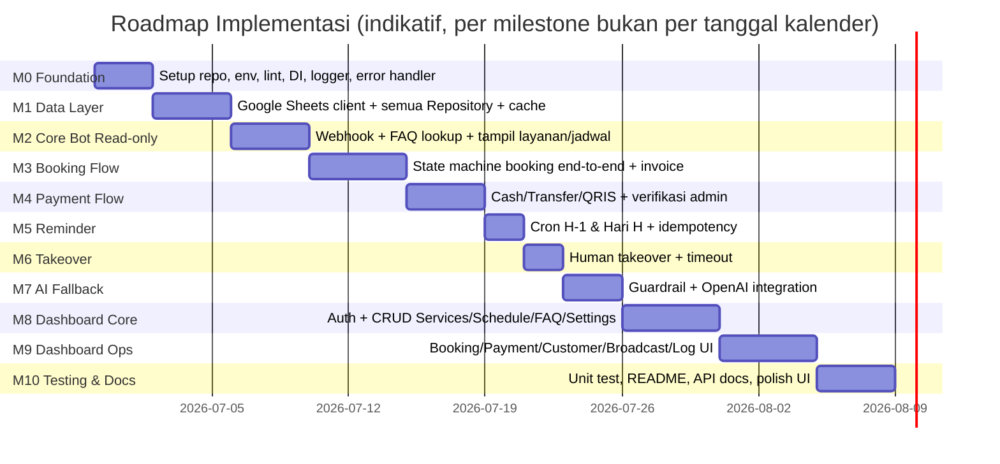

# Kania Happy — WhatsApp Booking System
## Tahap 1: Analisis & Desain Sistem (Pre-Implementation)

> Dokumen ini adalah deliverable Tahap 1 sesuai strategi implementasi yang diminta.
> Tidak ada kode aplikasi yang ditulis di tahap ini — fokus pada analisis, arsitektur, dan desain.
> Implementasi modul demi modul akan dimulai setelah dokumen ini direview dan disetujui.

---

## 1. ANALISIS KEBUTUHAN

### 1.1 Aktor Sistem

| Aktor | Kebutuhan Utama |
|---|---|
| **Customer (via WhatsApp)** | Tanya FAQ, lihat layanan/harga/jadwal, booking, bayar, terima reminder |
| **Admin (via Dashboard Web)** | Kelola data master, verifikasi pembayaran, takeover chat, broadcast, lihat log |
| **Bot Engine (otomatis)** | Jalankan rule-based flow, FAQ lookup, fallback ke AI, jadwal reminder |
| **AI (OpenAI, opsional)** | Jawab pertanyaan umum seputar Kania Happy yang tidak ada di FAQ |

### 1.2 Functional Requirements (ringkas, mengacu ke OBJECTIVE)

- FR-1: Bot membalas FAQ dari Spreadsheet, fallback ke AI bila tidak ketemu & masih relevan.
- FR-2: Bot menampilkan daftar layanan & harga dari sheet `Services`.
- FR-3: Bot menampilkan jadwal (occurrence mingguan) mulai hari ini dan seterusnya, tanpa batasan kuota.
- FR-4: Customer dapat melakukan booking end-to-end (pilih layanan → jadwal → nama → metode bayar → invoice).
- FR-5: Sistem generate invoice dengan nomor unik.
- FR-6: Sistem mendukung 3 metode bayar: Cash, Transfer, QRIS — masing-masing punya status flow berbeda.
- FR-7: Admin dapat verifikasi pembayaran Transfer/QRIS → status `Paid`.
- FR-8: Reminder otomatis H-1 dan Hari H untuk seluruh booking aktif (termasuk Cash).
- FR-9: Admin dapat takeover chat (bot non-aktif sementara, default 30 menit, lalu auto-resume).
- FR-10: Dashboard CRUD penuh untuk semua entitas + broadcast + settings + log aktivitas.
- FR-11: AI dibatasi guardrail topik Kania Happy saja, dengan fallback message yang sudah ditentukan.
- FR-12: Bot hanya menyimpan Nama, No. WhatsApp, dan Riwayat Booking (data minimization).

### 1.3 Non-Functional Requirements

- **Maintainability**: Clean Architecture, file ≤ ~300 baris, modular per domain.
- **Testability**: business logic terpisah dari I/O (Express, Spreadsheet, WA), unit-testable.
- **Reliability**: Global error handler, retry-safe terhadap Google Sheets API rate limit.
- **Security**: tidak ada secret hardcode, validasi input di setiap layer boundary, admin auth di dashboard.
- **Observability**: logger terstruktur (Winston/Pino) untuk Booking, Payment, Reminder, Broadcast, Login Admin, Error.
- **Performance**: caching ringan untuk data yang sering dibaca (Services, Schedule, FAQ, Settings) untuk mengurangi hit ke Google Sheets API.

### 1.4 Out of Scope (Tahap 1)

- Tidak membangun AI Agent otonom (sesuai instruksi eksplisit: bukan AI Agent).
- Tidak mengelola pembayaran otomatis (payment gateway). Verifikasi tetap manual oleh admin.
- Tidak multi-tenant (1 sanggar = 1 instance).

---

## 2. IDENTIFIKASI RISIKO

| # | Risiko | Dampak | Mitigasi |
|---|---|---|---|
| 1 | **Google Sheets sebagai DB**: rate limit API (100 req/100s/user) | Bot lambat/gagal saat traffic tinggi | Caching in-memory dengan TTL untuk data master (Services, Schedule, FAQ, Settings); batching read/write; debounce write |
| 2 | **Spreadsheet diedit manual oleh admin secara tidak konsisten** (ubah struktur kolom) | Bot/parsing rusak | Header row validasi saat startup; dokumentasi ketat struktur sheet; opsi "lock header row" di Google Sheets |
| 3 | **Baileys session terputus** | Bot tidak bisa kirim/terima pesan | Health-check endpoint + auto-reconnect + alert log; admin dashboard menampilkan status koneksi WA; session persisten di disk (`sessions/baileys/`) sehingga tidak perlu scan QR ulang setelah restart |
| 4 | **AI keluar dari guardrail (jailbreak/prompt injection dari user)** | AI menjawab di luar topik / bocor instruksi sistem | System prompt strict + post-filter response (keyword/topic classifier sederhana) + hard fallback message bila skor relevansi rendah |
| 5 | **Salah perhitungan reminder (timezone)** | Reminder terkirim di waktu salah | Standarisasi timezone `Asia/Jakarta` di seluruh sistem (node-cron + date lib seperti `date-fns-tz`), unit test khusus untuk reminder scheduler |
| 6 | **Admin takeover tidak ter-track / bot tetap balas saat admin sedang chat** | Customer bingung dapat 2 balasan berbeda | State takeover disimpan per nomor WA (in-memory + persist ke sheet `Admin Log`/state sheet) dengan TTL 30 menit, dicek di setiap incoming message sebelum bot proses |
| 7 | **Kebocoran data pribadi** (menyimpan lebih dari yang diizinkan) | Melanggar prinsip data minimization yang diminta | DTO/schema validator membatasi field yang boleh disimpan ke `Customer` sheet; code review checklist |
| 8 | **File besar / kode menumpuk dalam 1 file** | Sulit maintain | Enforce struktur folder per domain + ESLint rule max-lines + review manual per milestone |
| 9 | **Tidak ada batasan kuota → kelas bisa membludak** jika banyak yang booking di hari/jam sama | Kelas penuh sesak, kualitas layanan turun | Karena ini keputusan bisnis (memang tidak ada limit), mitigasi cukup di sisi monitoring: dashboard menampilkan jumlah booking per occurrence agar admin bisa pantau dan menyesuaikan jadwal/kapasitas instruktur secara manual bila perlu |
| 10 | **Biaya OpenAI API membengkak** | Cost tidak terkendali | AI hanya dipanggil sebagai fallback (FAQ miss), rate-limit per nomor per hari, log token usage |

---

## 3. ARSITEKTUR SISTEM

### 3.1 Gaya Arsitektur

Clean Architecture dengan 4 layer, diterapkan konsisten di **backend (bot + API)**:

```
Presentation (Controllers / WA Webhook Handler / Cron Triggers)
        ↓ depends on
Application (Services / Use Cases)
        ↓ depends on
Domain (Entities, Value Objects, Interfaces / Ports)
        ↑ implemented by
Infrastructure (Repository Implementations: Google Sheets, BaileysClient, OpenAI client, Logger)
```

Aturan dependency: **layer luar boleh tergantung ke layer dalam, tidak sebaliknya**. Domain tidak tahu apa-apa tentang Express, Google Sheets, atau Baileys — hanya mendefinisikan interface (port). Infrastructure mengimplementasikan interface tersebut (adapter). Ini membuat Repository Pattern + Dependency Injection menjadi natural.

### 3.2 Diagram Arsitektur (Mermaid)



### 3.3 Prinsip Desain yang Diterapkan

- **SOLID**: Service hanya bergantung ke interface Repository (Dependency Inversion), satu Service = satu tanggung jawab domain (SRP).
- **Repository Pattern**: setiap sheet punya Repository sendiri (`BookingRepository`, `CustomerRepository`, dst.) yang mengimplementasikan interface domain.
- **Service Layer**: seluruh business rule (cek kuota, generate invoice, hitung status pembayaran) berada di Service, bukan di Controller maupun Repository.
- **DI**: Service menerima Repository via constructor injection (manual container sederhana, tanpa framework berat — sesuai skala proyek, mengikuti KISS/YAGNI).
- **DRY/KISS/YAGNI**: util bersama (formatter invoice, formatter tanggal, validator nomor WA) ditaruh di `shared/utils`; tidak membangun abstraksi berlebihan yang belum dibutuhkan (misal tidak bikin generic ORM, cukup Repository per sheet dengan base class kecil).

---

## 4. STRUKTUR FOLDER

```
kania-happy-booking/
├── apps/
│   ├── server/                          # Backend: Bot + REST API
│   │   ├── src/
│   │   │   ├── domain/                  # Layer paling dalam — tidak ada dependency luar
│   │   │   │   ├── entities/
│   │   │   │   │   ├── Booking.entity.ts
│   │   │   │   │   ├── Customer.entity.ts
│   │   │   │   │   ├── Schedule.entity.ts
│   │   │   │   │   ├── Service.entity.ts
│   │   │   │   │   ├── Payment.entity.ts
│   │   │   │   │   └── Faq.entity.ts
│   │   │   │   ├── repositories/        # Interfaces (ports) saja
│   │   │   │   │   ├── IBookingRepository.ts
│   │   │   │   │   ├── ICustomerRepository.ts
│   │   │   │   │   ├── IScheduleRepository.ts
│   │   │   │   │   ├── IServiceRepository.ts
│   │   │   │   │   ├── IPaymentRepository.ts
│   │   │   │   │   ├── IFaqRepository.ts
│   │   │   │   │   ├── IBroadcastRepository.ts
│   │   │   │   │   ├── ISettingsRepository.ts
│   │   │   │   │   └── IAdminLogRepository.ts
│   │   │   │   └── value-objects/
│   │   │   │       ├── InvoiceNumber.ts
│   │   │   │       ├── PaymentStatus.ts
│   │   │   │       └── PhoneNumber.ts
│   │   │   │
│   │   │   ├── application/             # Use case / business logic
│   │   │   │   ├── booking/
│   │   │   │   │   ├── CreateBookingService.ts
│   │   │   │   │   ├── GetAvailableScheduleService.ts
│   │   │   │   │   └── BookingStateMachine.ts      # tracking step percakapan booking
│   │   │   │   ├── payment/
│   │   │   │   │   ├── GenerateInvoiceService.ts
│   │   │   │   │   ├── PaymentMethodHandlerService.ts
│   │   │   │   │   └── VerifyPaymentService.ts
│   │   │   │   ├── faq/
│   │   │   │   │   └── FaqLookupService.ts
│   │   │   │   ├── ai/
│   │   │   │   │   ├── AiFallbackService.ts
│   │   │   │   │   └── AiGuardrailService.ts
│   │   │   │   ├── reminder/
│   │   │   │   │   └── ReminderSchedulerService.ts
│   │   │   │   ├── takeover/
│   │   │   │   │   └── HumanTakeoverService.ts
│   │   │   │   └── dashboard/
│   │   │   │       ├── ServicesAdminService.ts
│   │   │   │       ├── ScheduleAdminService.ts
│   │   │   │       ├── BookingAdminService.ts
│   │   │   │       ├── CustomerAdminService.ts
│   │   │   │       ├── FaqAdminService.ts
│   │   │   │       ├── BroadcastAdminService.ts
│   │   │   │       └── SettingsAdminService.ts
│   │   │   │
│   │   │   ├── infrastructure/          # Implementasi konkret (adapters)
│   │   │   │   ├── google-sheets/
│   │   │   │   │   ├── GoogleSheetsClient.ts        # wrapper koneksi & auth
│   │   │   │   │   ├── BookingRepository.ts
│   │   │   │   │   ├── CustomerRepository.ts
│   │   │   │   │   ├── ScheduleRepository.ts
│   │   │   │   │   ├── ServiceRepository.ts
│   │   │   │   │   ├── PaymentRepository.ts
│   │   │   │   │   ├── FaqRepository.ts
│   │   │   │   │   ├── BroadcastRepository.ts
│   │   │   │   │   ├── SettingsRepository.ts
│   │   │   │   │   ├── AdminLogRepository.ts
│   │   │   │   │   └── SheetCache.ts                 # TTL in-memory cache
│   │   │   │   ├── whatsapp/
│   │   │   │   │   ├── BaileysClient.ts
│   │   │   │   │   └── WhatsAppMessageSender.ts
│   │   │   │   ├── ai/
│   │   │   │   │   └── OpenAiClient.ts
│   │   │   │   ├── logger/
│   │   │   │   │   └── Logger.ts                      # Winston/Pino instance
│   │   │   │   └── persistence/
│   │   │   │       └── TakeoverStateStore.ts          # in-memory + sheet-backed state
│   │   │   │
│   │   │   ├── presentation/
│   │   │   │   ├── http/
│   │   │   │   │   ├── controllers/
│   │   │   │   │   │   ├── BookingController.ts
│   │   │   │   │   │   ├── ServiceController.ts
│   │   │   │   │   │   ├── ScheduleController.ts
│   │   │   │   │   │   ├── PaymentController.ts
│   │   │   │   │   │   ├── CustomerController.ts
│   │   │   │   │   │   ├── FaqController.ts
│   │   │   │   │   │   ├── BroadcastController.ts
│   │   │   │   │   │   ├── SettingsController.ts
│   │   │   │   │   │   ├── AdminLogController.ts
│   │   │   │   │   │   ├── AuthController.ts
│   │   │   │   │   │   └── WhatsAppWebhookController.ts
│   │   │   │   │   ├── routes/
│   │   │   │   │   │   └── index.ts (+ per-domain route files)
│   │   │   │   │   ├── middlewares/
│   │   │   │   │   │   ├── errorHandler.ts
│   │   │   │   │   │   ├── authMiddleware.ts
│   │   │   │   │   │   ├── validateRequest.ts
│   │   │   │   │   │   └── requestLogger.ts
│   │   │   │   │   └── validators/
│   │   │   │   │       ├── booking.validator.ts
│   │   │   │   │       ├── payment.validator.ts
│   │   │   │   │       └── ...
│   │   │   │   └── cron/
│   │   │   │       ├── reminderH1.cron.ts
│   │   │   │       └── reminderHariH.cron.ts
│   │   │   │
│   │   │   ├── shared/
│   │   │   │   ├── config/
│   │   │   │   │   └── env.ts             # validasi & expose env var ber-tipe
│   │   │   │   ├── constants/
│   │   │   │   │   └── index.ts
│   │   │   │   ├── utils/
│   │   │   │   │   ├── invoiceGenerator.ts
│   │   │   │   │   ├── dateHelper.ts
│   │   │   │   │   └── phoneFormatter.ts
│   │   │   │   ├── di/
│   │   │   │   │   └── container.ts        # simple DI container manual
│   │   │   │   └── types/
│   │   │   │       └── index.ts
│   │   │   │
│   │   │   └── main.ts                      # entry point Express app
│   │   │
│   │   ├── tests/
│   │   │   ├── unit/
│   │   │   │   ├── booking.service.test.ts
│   │   │   │   ├── invoiceGenerator.test.ts
│   │   │   │   ├── paymentStatus.test.ts
│   │   │   │   ├── reminderScheduler.test.ts
│   │   │   │   └── faqLookup.test.ts
│   │   │   └── mocks/
│   │   │       └── repositories.mock.ts
│   │   │
│   │   ├── .env.example
│   │   ├── package.json
│   │   ├── tsconfig.json
│   │   ├── .eslintrc.cjs
│   │   └── .prettierrc
│   │
│   └── dashboard/                        # Frontend: React + Vite + Tailwind
│       ├── src/
│       │   ├── pages/
│       │   │   ├── DashboardPage.tsx
│       │   │   ├── BookingPage.tsx
│       │   │   ├── CustomerPage.tsx
│       │   │   ├── SchedulePage.tsx
│       │   │   ├── ServicePage.tsx
│       │   │   ├── FaqPage.tsx
│       │   │   ├── PaymentPage.tsx
│       │   │   ├── BroadcastPage.tsx
│       │   │   ├── SettingsPage.tsx
│       │   │   └── ActivityLogPage.tsx
│       │   ├── components/
│       │   │   ├── ui/                   # Button, Modal, Table, Badge, Skeleton, EmptyState, Toast
│       │   │   ├── layout/               # Sidebar, Topbar, ThemeToggle
│       │   │   └── domain/               # BookingTable, PaymentVerifyModal, dst.
│       │   ├── hooks/
│       │   ├── lib/
│       │   │   └── apiClient.ts
│       │   ├── store/                    # state management ringan (Zustand/Context)
│       │   ├── types/
│       │   ├── App.tsx
│       │   └── main.tsx
│       ├── package.json
│       ├── tailwind.config.ts
│       └── vite.config.ts
│
├── docs/
│   ├── 01-DESIGN-DOCUMENT.md             # dokumen ini
│   ├── API.md
│   ├── ARCHITECTURE.md
│   └── diagrams/
│
├── README.md
├── package.json                          # workspace root (npm workspaces)
└── .gitignore
```

> Catatan: struktur monorepo sederhana (`apps/server`, `apps/dashboard`) dipilih agar backend dan frontend tetap terpisah jelas tapi mudah dikelola dalam satu repo, sesuai skala proyek (KISS/YAGNI — tidak perlu microservices).

---

## 5. DESAIN SPREADSHEET (DATABASE)

Spreadsheet utama: **`Kania Happy - Database`**, terdiri dari 9 sheet berikut. Baris pertama setiap sheet = header (dikunci/divalidasi saat startup).

### 5.1 `Services`
| Kolom | Tipe | Keterangan |
|---|---|---|
| service_id | string | unik, contoh `SVC001` |
| name | string | nama layanan, contoh "Senam Aerobik" |
| price | number | harga dalam Rupiah |
| is_active | boolean | tampil di bot atau tidak |

> Detail seperti deskripsi senam, manfaat, dll dijawab lewat sheet `FAQ`, bukan disimpan di sini — menghindari duplikasi data antara dua sheet.

### 5.2 `Schedule` — **Template Mingguan (Recurring), bukan tanggal spesifik**

> **Update keputusan**: jadwal kelas berulang tiap minggu di hari & jam yang sama, sehingga sheet ini menyimpan **template per hari-dalam-minggu**, bukan per tanggal. Tanggal aktual (occurrence) dihitung otomatis oleh sistem saat customer booking (lihat §5.2.1).

| Kolom | Tipe | Keterangan |
|---|---|---|
| schedule_id | string | unik, contoh `SCH001` |
| service_id | string | FK ke Services |
| day_of_week | enum | `Senin`/`Selasa`/`Rabu`/`Kamis`/`Jumat`/`Sabtu`/`Minggu` (disimpan sebagai angka 0-6 secara internal, ditampilkan sebagai nama hari di Spreadsheet) |
| time_start | string (HH:mm) | jam mulai |
| time_end | string (HH:mm) | jam selesai |
| is_active | boolean | jadwal ini masih berjalan atau sudah dihentikan |

> **Tidak ada batasan kuota** per pertemuan (sesuai keputusan terbaru) — jadi tidak ada kolom kuota di sini maupun di `Booking`.

#### 5.2.1 Cara Menghitung Jadwal Tersedia (Schedule Occurrence)

Karena `Schedule` hanya berisi *pattern* mingguan, sistem perlu men-generate **occurrence** (tanggal aktual) secara on-the-fly:

1. Ambil semua `Schedule` dengan `is_active = true`.
2. Untuk window "hari ini s.d. N hari ke depan" (default 7 hari, dikonfigurasi via `Settings.schedule_lookahead_days`), hitung tanggal aktual setiap `day_of_week` yang jatuh di window tersebut.
3. Tampilkan seluruh occurrence tersebut ke customer — **tanpa filter kuota**, karena tidak ada batasan jumlah peserta per pertemuan.

Logika ini berada di `GetAvailableScheduleService` (Application layer), bukan di Repository — Repository hanya menyediakan data mentah (`findActiveSchedules()`), kalkulasi tanggal occurrence tetap dipisah sebagai business logic yang mudah di-unit-test.

### 5.3 `Booking`
| Kolom | Tipe | Keterangan |
|---|---|---|
| booking_id | string | unik |
| invoice_number | string | FK ke Payment |
| customer_phone | string | FK ke Customer |
| customer_name | string | snapshot nama saat booking |
| service_id | string | FK ke Services |
| schedule_id | string | FK ke Schedule (template mingguan) |
| booking_date | date (YYYY-MM-DD) | **tanggal aktual pertemuan** hasil generate occurrence (lihat §5.2.1) — inilah yang dipakai untuk hitung kuota & reminder |
| payment_method | enum | `Cash` / `Transfer` / `QRIS` |
| booking_status | enum | `Pending` / `Confirmed` / `Cancelled` |
| created_at | datetime | |
| reminder_h1_sent | boolean | flag agar tidak double-send |
| reminder_hariH_sent | boolean | flag agar tidak double-send |

### 5.4 `Payment`
| Kolom | Tipe | Keterangan |
|---|---|---|
| invoice_number | string | unik, format lihat §9.1 |
| booking_id | string | FK ke Booking |
| amount | number | nominal |
| method | enum | `Cash` / `Transfer` / `QRIS` |
| status | enum | `Cash` / `Waiting Verification` / `Paid` / `Rejected` |
| proof_image_url | string | bukti transfer (dari WA media, disimpan via Baileys media download) |
| verified_by | string | admin yang verifikasi |
| verified_at | datetime | |
| created_at | datetime | |

### 5.5 `Customer`
| Kolom | Tipe | Keterangan |
|---|---|---|
| phone | string | primary key (format E.164/62xxx) |
| name | string | |
| first_contact_at | datetime | |
| last_booking_at | datetime | |
| total_booking | number | counter |

### 5.6 `FAQ`
| Kolom | Tipe | Keterangan |
|---|---|---|
| faq_id | string | |
| keyword | string | kata kunci/pattern untuk matching |
| question | string | pertanyaan contoh |
| answer | string | jawaban tetap |
| is_active | boolean | |

### 5.7 `Broadcast`

> **Update keputusan**: broadcast hanya dikirim ke customer yang booking-nya berstatus **Paid** atau **Cash** (sudah pasti datang/bayar), bukan ke seluruh kontak. Ini juga selaras dengan prinsip data minimization — broadcast tidak menyasar nomor yang sekadar pernah tanya-tanya tanpa booking.

| Kolom | Tipe | Keterangan |
|---|---|---|
| broadcast_id | string | |
| message | string | isi pesan |
| target_segment | enum | `PaidOrCash` (semua customer dengan minimal 1 booking berstatus `Paid`/`Cash`) / `Custom` (admin pilih manual dari subset Paid/Cash, misal hanya peserta kelas tertentu) |
| status | enum | `Draft` / `Scheduled` / `Sent` / `Failed` |
| scheduled_at | datetime | nullable |
| sent_at | datetime | nullable |
| created_by | string | admin |

**Catatan implementasi**: `BroadcastAdminService` mengambil daftar penerima dengan query gabungan `Booking` (status `Paid`/`Cash`) → `Customer` (ambil nomor unik), bukan dari seluruh sheet `Customer`. Untuk `Custom`, admin dapat memfilter lebih lanjut (misal per `service_id` atau per `booking_date`) tapi tetap dibatasi hanya dari pool customer Paid/Cash tersebut.

### 5.8 `Settings`
| Kolom | Tipe | Keterangan |
|---|---|---|
| key | string | contoh `bank_account_number`, `bank_name`, `qris_image_url`, `takeover_timeout_minutes`, `business_hours`, `ai_enabled` |
| value | string | |
| description | string | |

### 5.9 `Admin Log`
| Kolom | Tipe | Keterangan |
|---|---|---|
| log_id | string | |
| admin_username | string | |
| action | enum | `Login` / `VerifyPayment` / `Takeover` / `EditService` / dll |
| target_id | string | nullable, id entitas yang diubah |
| description | string | |
| created_at | datetime | |

> Sheet tambahan internal (tidak disebut di OBJECTIVE tapi diperlukan teknis): **`Takeover State`** (phone, is_taken_over, taken_over_by, started_at, expires_at) — disimpan terpisah agar Admin Log tetap murni audit trail, sedangkan Takeover State adalah live state.

---

## 6. DIAGRAM MERMAID

### 6.1 Flow Booking



### 6.2 Flow Pembayaran



### 6.3 Flow Reminder



### 6.4 Flow WhatsApp (Inbound Message Handling)



### 6.5 Flow AI (Guardrail Detail)

```mermaid
flowchart TD
    Q[Pertanyaan customer] --> FAQ[Cek FAQ Spreadsheet]
    FAQ -->|Ketemu| A1[Jawab langsung, AI TIDAK dipanggil]
    FAQ -->|Tidak ketemu| TOPIC{Topic Classifier:\nrelevan ke Kania Happy?}
    TOPIC -->|Tidak relevan\nresep/coding/politik/dll| A2[Kirim template penolakan tetap]
    TOPIC -->|Relevan| SYS[Bangun system prompt:\nrole=CS Kania Happy\nbatas topik\nbatas larangan]
    SYS --> CALL[Call OpenAI API]
    CALL --> POST{Post-filter:\nresponse masih dalam topik & tidak mengarang data?}
    POST -->|Lolos| A3[Kirim jawaban AI]
    POST -->|Gagal| A4[Kirim: "Informasi belum tersedia, admin akan membantu"]
```

### 6.6 Flow Dashboard (Admin)

```mermaid
flowchart TD
    Login[Admin Login] --> Auth{Valid?}
    Auth -->|Tidak| LoginFail[Tampilkan error]
    Auth -->|Ya| Log[Catat ke Admin Log]
    Log --> Dash[Dashboard Home: ringkasan booking, revenue, kelas hari ini]
    Dash --> Nav{Pilih menu}
    Nav --> Booking[Booking: list, filter, detail]
    Nav --> Payment[Payment: verifikasi Transfer/QRIS]
    Nav --> Customer[Customer: list & riwayat]
    Nav --> Schedule[Jadwal: CRUD]
    Nav --> Service[Layanan: CRUD]
    Nav --> Faq[FAQ: CRUD]
    Nav --> Broadcast[Broadcast: compose & kirim]
    Nav --> Settings[Settings: rekening, QRIS, timeout takeover]
    Nav --> ActivityLog[Log Aktivitas: read-only audit]
    Payment --> Verify[Klik Verifikasi -> update Payment & Booking status]
    Verify --> Log
    Booking --> Takeover[Tombol "Takeover Chat"]
    Takeover --> Log
```

---

## 7. DESAIN API

Base URL: `/api/v1`. Autentikasi dashboard: JWT (admin login). Tidak ada endpoint webhook eksternal — pesan WA diterima langsung via Baileys event listener.

### 7.1 Daftar Endpoint (ringkasan)

| Method | Endpoint | Deskripsi | Auth |
|---|---|---|---|
| POST | `/auth/login` | Login admin | Public |
| POST | `/webhook/whatsapp` | Terima notifikasi internal (opsional, untuk integrasi masa depan) | Admin JWT |
| GET | `/services` | List layanan | Admin |
| POST | `/services` | Tambah layanan | Admin |
| PUT | `/services/:id` | Edit layanan | Admin |
| DELETE | `/services/:id` | Hapus (soft) layanan | Admin |
| GET | `/schedules?service_id=&from=&days=` | List occurrence jadwal (hasil generate dari template mingguan) + filter | Admin |
| GET | `/schedules/templates` | List template mingguan mentah (untuk dikelola admin) | Admin |
| POST | `/schedules/templates` | Tambah template jadwal mingguan | Admin |
| PUT | `/schedules/templates/:id` | Edit template jadwal | Admin |
| DELETE | `/schedules/templates/:id` | Hapus template jadwal | Admin |
| GET | `/bookings?status=&page=&search=` | List booking (pagination, filter, search) | Admin |
| GET | `/bookings/:id` | Detail booking | Admin |
| PATCH | `/bookings/:id/status` | Update status booking manual | Admin |
| GET | `/payments?status=` | List pembayaran | Admin |
| PATCH | `/payments/:invoiceNumber/verify` | Verifikasi pembayaran | Admin |
| PATCH | `/payments/:invoiceNumber/reject` | Tolak pembayaran | Admin |
| GET | `/customers?search=&page=` | List customer | Admin |
| GET | `/customers/:phone/bookings` | Riwayat booking customer | Admin |
| GET | `/faqs` | List FAQ | Admin |
| POST | `/faqs` | Tambah FAQ | Admin |
| PUT | `/faqs/:id` | Edit FAQ | Admin |
| DELETE | `/faqs/:id` | Hapus FAQ | Admin |
| POST | `/broadcasts` | Buat & kirim/schedule broadcast | Admin |
| GET | `/broadcasts` | List broadcast + status | Admin |
| GET | `/settings` | Ambil semua settings | Admin |
| PUT | `/settings/:key` | Update 1 setting | Admin |
| GET | `/admin-logs?page=` | List log aktivitas | Admin |
| POST | `/chats/:phone/takeover` | Admin ambil alih chat | Admin |
| POST | `/chats/:phone/release` | Admin lepas takeover manual | Admin |
| GET | `/chats/:phone/status` | Cek status takeover suatu nomor | Admin |

### 7.2 Contoh Request/Response

**POST `/auth/login`**
```json
// Request
{ "username": "admin", "password": "secret123" }

// Response 200
{
  "success": true,
  "data": {
    "token": "eyJhbGciOi...",
    "expiresIn": 3600,
    "admin": { "username": "admin", "role": "owner" }
  }
}
```

**GET `/schedules?service_id=SVC001&from=2026-06-28&days=7`**
```json
// Response 200
{
  "success": true,
  "data": [
    {
      "schedule_id": "SCH001",
      "service_id": "SVC001",
      "service_name": "Senam Aerobik",
      "day_of_week": "Senin",
      "booking_date": "2026-06-29",
      "time_start": "08:00",
      "time_end": "09:00"
    }
  ]
}
```

**PATCH `/payments/INV-20260628-0007/verify`**
```json
// Request
{ "verified_by": "admin_rina" }

// Response 200
{
  "success": true,
  "message": "Pembayaran berhasil diverifikasi",
  "data": {
    "invoice_number": "INV-20260628-0007",
    "status": "Paid",
    "verified_by": "admin_rina",
    "verified_at": "2026-06-28T10:15:00+07:00"
  }
}
```

**Format Error Response (Global Error Handler) — konsisten di semua endpoint**
```json
{
  "success": false,
  "error": {
    "code": "VALIDATION_ERROR",
    "message": "Field 'service_id' wajib diisi",
    "details": [{ "field": "service_id", "issue": "required" }]
  }
}
```

> Dokumentasi API lengkap (semua endpoint + skema) akan ditulis di `docs/API.md` pada saat implementasi endpoint terkait, agar selalu sinkron dengan kode aktual (dihindari dokumentasi "basi").

---

## 8. DESAIN MODUL

| Modul | Service Utama | Repository yang Dipakai | Tanggung Jawab |
|---|---|---|---|
| **Booking** | `CreateBookingService`, `BookingStateMachine` | Booking, Schedule, Customer | Validasi kuota, simpan booking, update kuota, trigger invoice |
| **Payment** | `GenerateInvoiceService`, `PaymentMethodHandlerService`, `VerifyPaymentService` | Payment, Booking, Settings | Generate invoice unik, kirim instruksi sesuai metode, ubah status |
| **Schedule** | `GetAvailableScheduleService` | Schedule | Filter jadwal >= hari ini & kuota tersedia |
| **FAQ** | `FaqLookupService` | Faq | Pencarian keyword/fuzzy match di sheet FAQ |
| **AI Fallback** | `AiFallbackService`, `AiGuardrailService` | Settings (ai_enabled) | Topic classification, system prompt builder, post-filter |
| **Reminder** | `ReminderSchedulerService` | Booking, Schedule, Customer | Cron H-1 & Hari H, idempotent (flag sent) |
| **Takeover** | `HumanTakeoverService` | TakeoverState (+ Admin Log) | Set/release takeover, cek status sebelum bot proses pesan |
| **Dashboard/Admin** | `*AdminService` per domain | semua repository | CRUD untuk setiap entitas via REST API |
| **Auth** | `AuthService` | Admin (1 role tunggal: "Admin", bisa env-based untuk MVP atau sheet `Admin`) | Login, JWT issuance |
| **Logger/Error** | cross-cutting, dipakai semua layer | - | Logging terstruktur & global error catcher |

**Catatan desain Booking State Machine**: karena percakapan WA bersifat multi-turn (pilih layanan → jadwal → nama → bayar), dibutuhkan state per nomor WA yang menyimpan "langkah saat ini". Disimpan in-memory (Map) dengan TTL, tidak perlu sheet terpisah — state ini sementara, bukan data permanen (selaras dengan prinsip MEMORY: hanya simpan Nama, No. WA, Riwayat Booking secara permanen).

---

## 9. DESAIN DASHBOARD

### 9.1 Invoice Number Format
`INV-YYYYMMDD-XXXX` (XXXX = sequence harian, reset tiap hari, di-generate oleh `InvoiceNumber` value object — pure function, mudah di-unit-test).

### 9.2 Layout & Navigasi
- **Sidebar** kiri: Dashboard, Booking, Customer, Jadwal, Layanan, FAQ, Pembayaran, Broadcast, Settings, Log Aktivitas.
- **Topbar**: search global, toggle dark mode, profil admin.
- **Dashboard Home**: kartu ringkasan (booking hari ini, pending verifikasi, revenue bulan ini, kelas akan datang), grafik sederhana.

### 9.3 Komponen UI Wajib (Reusable)
- `DataTable` (sorting, pagination, search, filter) — dipakai di semua list page.
- `Modal` + `ConfirmDialog` — untuk konfirmasi hapus/verifikasi.
- `Toast` — notifikasi sukses/gagal global (context-based).
- `Skeleton` — loading state per tabel/card.
- `EmptyState` — saat data kosong, dengan ilustrasi + CTA.
- `Badge` — status (Pending/Paid/Confirmed/dll dengan warna konsisten).
- `ThemeToggle` — dark/light, disimpan di localStorage frontend saja (bukan di Spreadsheet).

### 9.4 Halaman Pembayaran (highlight UX)
List dengan filter status (`Waiting Verification` default tampil paling atas), tiap row ada tombol **Verifikasi** (buka modal preview bukti transfer + tombol confirm) dan **Tolak** (wajib isi alasan singkat).

---

## 10. DESAIN WHATSAPP FLOW

Sudah dijelaskan detail di diagram §6.1, §6.4. Ringkasan prinsip:

1. Setiap pesan masuk dicek dulu status **takeover** → kalau aktif, bot diam total.
2. Kalau tidak takeover, cek apakah customer sedang di tengah **booking state machine** → kalau ya, lanjutkan step berikutnya (jangan mulai ulang).
3. Kalau tidak ada state aktif, deteksi intent sederhana berbasis keyword/menu angka (bot WA pakai menu angka/list interaktif via Baileys, bukan NLU kompleks — sesuai prinsip "rule-based, bukan AI Agent").
4. FAQ selalu dicoba dulu sebelum AI dipanggil (FR-1).

## 11. DESAIN AI FLOW

Sudah dijelaskan di diagram §6.5. Detail tambahan **AiGuardrailService**:

- **Pre-filter (sebelum call OpenAI)**: cek daftar topik terlarang (resep, coding, matematika, berita, politik, agama, hiburan, kesehatan umum, terjemahan, puisi, artikel, email, kode program) via keyword/regex sederhana → kalau match, langsung kirim template penolakan, **tidak perlu panggil OpenAI** (hemat cost).
- **System Prompt** (disuntik ke setiap call): definisikan role sebagai CS Kania Happy, daftar topik yang BOLEH dijawab, instruksi keras "jangan mengarang data harga/jadwal/promo — kalau tidak ada di context, jawab info belum tersedia".
- **Context Injection**: AI tidak boleh mengarang data faktual → service ini akan menyuntikkan data real dari sheet (Services, Settings) ke dalam prompt sebagai context bila relevan, bukan membiarkan AI menebak.
- **Post-filter (setelah response)**: cek panjang & pola jawaban tidak mengandung penolakan/topik terlarang yang lolos; kalau ada indikasi off-topic, ganti dengan template fallback.

---

## 12. ROADMAP IMPLEMENTASI



## 13. PEMBAGIAN MILESTONE PENGEMBANGAN

| Milestone | Lingkup | Output Konkret |
|---|---|---|
| **M0 — Foundation** | Setup project skeleton | repo, tsconfig, eslint/prettier, env validator, logger, global error handler, DI container kosong |
| **M1 — Data Layer** | Koneksi & akses Spreadsheet | `GoogleSheetsClient`, seluruh Repository + interface domain, `SheetCache`, unit test repository (mocked) |
| **M2 — Bot Read-only** | Bot bisa jawab info tanpa transaksi | Webhook handler, FAQ lookup, tampilkan layanan & jadwal tersedia |
| **M3 — Booking Flow** | Booking end-to-end (tanpa pembayaran nyata) | Booking state machine, `CreateBookingService`, invoice generator + unit test |
| **M4 — Payment Flow** | 3 metode bayar lengkap | Payment service, kirim rekening/QRIS, halaman verifikasi (API dulu) |
| **M5 — Reminder** | Reminder otomatis | Cron H-1 & Hari H + unit test idempotency |
| **M6 — Human Takeover** | Admin override bot | Takeover service + timeout 30 menit |
| **M7 — AI Fallback** | AI sebagai pelengkap FAQ | Guardrail service + OpenAI client + unit test guardrail |
| **M8 — Dashboard Core** | Login & CRUD master data | React app, auth, halaman Services/Schedule/FAQ/Settings |
| **M9 — Dashboard Ops** | Operasional harian admin | Booking/Payment/Customer/Broadcast/Activity Log pages, dark mode, semua UI states (loading/empty/toast/modal) |
| **M10 — Testing, Docs, Polish** | Siap produksi | Lengkapi unit test, README.md, API.md, ARCHITECTURE.md, review akhir |

---

## ✅ Status Tahap 1

Dokumen ini mencakup seluruh poin yang diminta: analisis kebutuhan, risiko, arsitektur, struktur folder, desain spreadsheet, diagram Mermaid, desain API, desain modul, desain dashboard, desain WhatsApp flow, desain AI flow, roadmap, dan milestone.

**Keputusan yang sudah dikonfirmasi:**
1. Jadwal kelas bersifat **mingguan berulang** (`day_of_week`, bukan tanggal tetap), **tanpa batasan kuota** per pertemuan — sheet `Schedule` adalah template, tanggal aktual dihitung dinamis per occurrence (lihat §5.2.1).
2. Role admin **cukup 1: "Admin"** — tidak ada multi-role di MVP ini.
3. **Tidak menggunakan Docker** — deployment dijalankan langsung dengan Node.js (PM2 atau sejenisnya akan dijelaskan di README saat tahap dokumentasi).
4. Package manager: **npm**.
5. Sheet `Services` disederhanakan (tanpa description/duration — detail dijawab via FAQ); sheet `Broadcast` hanya menyasar customer dengan booking status `Paid`/`Cash`.

**Belum ada kode aplikasi yang ditulis** — sesuai strategi implementasi yang diminta. Implementasi akan dimulai dari **M0 (Foundation)** setelah dokumen ini direview dan disetujui.